# 🏠 Property Dealer CRM — Implementation Plan

> **Tech Stack:** Next.js 16.2.4 (App Router) · MongoDB + Mongoose · Tailwind CSS v4 · JWT (jose) · Socket.io · Zod  
> **Important:** This project uses Next.js 16 which uses `proxy.ts` instead of `middleware.ts` for route-level middleware.

---

## Project Folder Structure (Target)

```
property_crm/
├── app/
│   ├── (auth)/                    # Route group — public auth pages
│   │   ├── login/page.tsx
│   │   ├── signup/page.tsx
│   │   └── layout.tsx
│   ├── (dashboard)/               # Route group — protected pages
│   │   ├── layout.tsx             # Dashboard shell (sidebar + topbar)
│   │   ├── admin/
│   │   │   ├── page.tsx           # Admin dashboard (analytics)
│   │   │   └── agents/page.tsx    # Agent management
│   │   ├── leads/
│   │   │   ├── page.tsx           # Leads list
│   │   │   ├── new/page.tsx       # Create lead
│   │   │   └── [id]/
│   │   │       ├── page.tsx       # Lead detail + timeline
│   │   │       └── edit/page.tsx  # Edit lead
│   │   └── settings/page.tsx
│   ├── api/
│   │   ├── auth/
│   │   │   ├── signup/route.ts
│   │   │   ├── login/route.ts
│   │   │   └── logout/route.ts
│   │   ├── leads/
│   │   │   ├── route.ts           # GET all, POST create
│   │   │   └── [id]/
│   │   │       ├── route.ts       # GET one, PUT update, DELETE
│   │   │       ├── assign/route.ts
│   │   │       ├── timeline/route.ts
│   │   │       └── followup/route.ts
│   │   ├── agents/route.ts
│   │   ├── analytics/route.ts
│   │   ├── notifications/route.ts
│   │   └── socket/route.ts
│   ├── _components/               # Shared UI components
│   │   ├── Sidebar.tsx
│   │   ├── Topbar.tsx
│   │   ├── LeadCard.tsx
│   │   ├── LeadForm.tsx
│   │   ├── LeadTable.tsx
│   │   ├── Timeline.tsx
│   │   ├── StatsCard.tsx
│   │   ├── ChartWidget.tsx
│   │   └── Modal.tsx
│   ├── _lib/                      # Shared utilities
│   │   ├── db.ts                  # MongoDB connection
│   │   ├── session.ts             # JWT encrypt/decrypt
│   │   ├── dal.ts                 # Data Access Layer
│   │   ├── definitions.ts         # Zod schemas + types
│   │   ├── email.ts               # Email service
│   │   ├── scoring.ts             # Lead scoring logic
│   │   └── rate-limit.ts          # Rate limiting
│   ├── actions/                   # Server Actions
│   │   ├── auth.ts
│   │   ├── leads.ts
│   │   └── agents.ts
│   ├── globals.css
│   ├── layout.tsx                 # Root layout
│   ├── page.tsx                   # Landing / redirect
│   └── favicon.ico
├── models/                        # Mongoose models
│   ├── User.ts
│   ├── Lead.ts
│   └── Activity.ts
├── proxy.ts                       # Next.js 16 proxy (replaces middleware.ts)
├── .env.example
├── .env.local
├── package.json
└── ...
```

---

## Feature Branches & Commits

---

### 🔵 Branch 1: `feature/project-setup`
> Base scaffolding, DB connection, environment config, design system

| Step | What to Do | Files | Commit Message |
|------|-----------|-------|----------------|
| 1.1 | Install core dependencies: `mongoose`, `jose`, `bcryptjs`, `zod`, `server-only`, `nodemailer`, `socket.io`, `@types/bcryptjs`, `@types/nodemailer` | `package.json` | `chore: install core dependencies` |
| 1.2 | Create `.env.example` and `.env.local` with `MONGODB_URI`, `SESSION_SECRET`, `SMTP_HOST`, `SMTP_PORT`, `SMTP_USER`, `SMTP_PASS`, `NEXT_PUBLIC_APP_URL` | `.env.example`, `.env.local` | `chore: add environment configuration` |
| 1.3 | Create MongoDB connection utility using Mongoose with cached connection pattern | `app/_lib/db.ts` | `feat: add MongoDB connection utility` |
| 1.4 | Set up design system — update `globals.css` with custom color palette, typography, and Tailwind v4 theme tokens (dark CRM theme with blue/indigo accent) | `app/globals.css` | `style: set up design system and global styles` |
| 1.5 | Update root layout with proper metadata, fonts (Inter), and dark mode support | `app/layout.tsx` | `feat: update root layout with CRM branding` |
| 1.6 | Create landing page that redirects to `/login` or `/admin` based on session | `app/page.tsx` | `feat: create landing page with redirect logic` |
| 1.7 | Create reusable UI components: `Modal`, `StatsCard`, loading spinner | `app/_components/` | `feat: add shared UI components` |

**Git workflow:**
```bash
git checkout -b feature/project-setup
# ... implement steps 1.1 through 1.7, committing after each ...
git checkout main && git merge feature/project-setup
```

---

### 🔵 Branch 2: `feature/authentication`
> Signup, Login, Logout, JWT session management, password hashing  
> **Marks: 15**

| Step | What to Do | Files | Commit Message |
|------|-----------|-------|----------------|
| 2.1 | Create Mongoose User model with fields: `name`, `email`, `password`, `role` (enum: admin/agent), `createdAt` | `models/User.ts` | `feat: create User mongoose model` |
| 2.2 | Create Zod validation schemas for signup and login | `app/_lib/definitions.ts` | `feat: add auth validation schemas` |
| 2.3 | Create session management — JWT encrypt/decrypt using `jose`, cookie helpers using Next.js `cookies()` API | `app/_lib/session.ts` | `feat: add JWT session management` |
| 2.4 | Create Data Access Layer with `verifySession()` and `getUser()` | `app/_lib/dal.ts` | `feat: add data access layer for auth` |
| 2.5 | Create API route handlers for signup (`POST /api/auth/signup`) — validate with Zod, hash password with bcrypt, create user in MongoDB, create JWT session | `app/api/auth/signup/route.ts` | `feat: add signup API route` |
| 2.6 | Create API route handler for login (`POST /api/auth/login`) — validate credentials, verify password, create session | `app/api/auth/login/route.ts` | `feat: add login API route` |
| 2.7 | Create API route handler for logout (`POST /api/auth/logout`) — delete session cookie | `app/api/auth/logout/route.ts` | `feat: add logout API route` |
| 2.8 | Create Server Actions for auth (signup, login, logout) that call the session helpers and redirect | `app/actions/auth.ts` | `feat: add auth server actions` |
| 2.9 | Create auth layout with split-screen design (branding left, form right) | `app/(auth)/layout.tsx` | `feat: add auth layout with branding` |
| 2.10 | Create Signup page — client component with `useActionState`, form validation, error display, link to login | `app/(auth)/signup/page.tsx` | `feat: add signup page` |
| 2.11 | Create Login page — client component with `useActionState`, form validation, error display, link to signup | `app/(auth)/login/page.tsx` | `feat: add login page` |
| 2.12 | Seed script: create a default admin user on first run | `scripts/seed.ts` + update `package.json` | `feat: add admin seed script` |

**Git workflow:**
```bash
git checkout -b feature/authentication
# ... implement steps 2.1 through 2.12 ...
git checkout main && git merge feature/authentication
```

---

### 🔵 Branch 3: `feature/rbac`
> Role-Based Access Control, route protection via `proxy.ts`, authorization guards  
> **Marks: 15**

| Step | What to Do | Files | Commit Message |
|------|-----------|-------|----------------|
| 3.1 | Create `proxy.ts` at project root — decrypt JWT from cookie, protect `/admin/*` (admin only), `/leads/*` (both roles), redirect unauthenticated users to `/login` | `proxy.ts` | `feat: add proxy for route protection` |
| 3.2 | Create dashboard layout with sidebar + topbar — show different nav items based on role (admin sees analytics/agents, agent sees assigned-leads) | `app/(dashboard)/layout.tsx` | `feat: add dashboard layout with role-based nav` |
| 3.3 | Create Sidebar component — responsive, collapsible, role-aware navigation items | `app/_components/Sidebar.tsx` | `feat: add responsive sidebar component` |
| 3.4 | Create Topbar component — user avatar, role badge, logout button, notifications bell | `app/_components/Topbar.tsx` | `feat: add topbar with user info and logout` |
| 3.5 | Add authorization helpers: `requireAdmin()`, `requireAuth()` that verify role in DAL | `app/_lib/dal.ts` (update) | `feat: add role-based authorization helpers` |
| 3.6 | Create agent list page for admin — show all agents with their stats | `app/(dashboard)/admin/agents/page.tsx` | `feat: add agent management page` |
| 3.7 | Create API route to list all agents (admin only) | `app/api/agents/route.ts` | `feat: add agents API route` |

**Git workflow:**
```bash
git checkout -b feature/rbac
# ... implement steps 3.1 through 3.7 ...
git checkout main && git merge feature/rbac
```

---

### 🔵 Branch 4: `feature/lead-management`
> Full CRUD for leads, Lead model, forms, table, filters  
> **Marks: 15**

| Step | What to Do | Files | Commit Message |
|------|-----------|-------|----------------|
| 4.1 | Create Mongoose Lead model: `name`, `email`, `phone`, `propertyInterest`, `budget`, `status` (enum: New/Contacted/Qualified/Negotiation/Closed-Won/Closed-Lost), `notes`, `assignedTo` (ref User), `score`, `priority` (High/Medium/Low), `source` (Facebook/Walk-in/Website/Other), `followUpDate`, `createdAt`, `updatedAt` | `models/Lead.ts` | `feat: create Lead mongoose model` |
| 4.2 | Create Zod schemas for lead creation, update, and query filters | `app/_lib/definitions.ts` (update) | `feat: add lead validation schemas` |
| 4.3 | Create API routes: `GET /api/leads` (list with filters, pagination — admin sees all, agent sees assigned), `POST /api/leads` (create new lead) | `app/api/leads/route.ts` | `feat: add leads list and create API routes` |
| 4.4 | Create API routes: `GET /api/leads/[id]`, `PUT /api/leads/[id]`, `DELETE /api/leads/[id]` — with auth checks | `app/api/leads/[id]/route.ts` | `feat: add lead detail, update, delete API routes` |
| 4.5 | Create LeadTable component — sortable, filterable table with status badges, priority indicators, actions dropdown | `app/_components/LeadTable.tsx` | `feat: add lead table component` |
| 4.6 | Create LeadForm component — reusable for create/edit, with Zod validation, dropdowns for status/source/priority | `app/_components/LeadForm.tsx` | `feat: add lead form component` |
| 4.7 | Create LeadCard component — card view for leads with key info, quick actions | `app/_components/LeadCard.tsx` | `feat: add lead card component` |
| 4.8 | Create Leads listing page — data table with search, filters (status, priority, date, source), pagination, toggle list/card view | `app/(dashboard)/leads/page.tsx` | `feat: add leads listing page with filters` |
| 4.9 | Create New Lead page — form with validation and server action | `app/(dashboard)/leads/new/page.tsx` | `feat: add create lead page` |
| 4.10 | Create Lead Detail page — full lead info, edit button, delete button, assigned agent info | `app/(dashboard)/leads/[id]/page.tsx` | `feat: add lead detail page` |
| 4.11 | Create Lead Edit page — pre-filled form with update action | `app/(dashboard)/leads/[id]/edit/page.tsx` | `feat: add lead edit page` |
| 4.12 | Add Server Actions for lead operations (create, update, delete) with revalidation | `app/actions/leads.ts` | `feat: add lead server actions` |

**Git workflow:**
```bash
git checkout -b feature/lead-management
# ... implement steps 4.1 through 4.12 ...
git checkout main && git merge feature/lead-management
```

---

### 🔵 Branch 5: `feature/lead-scoring`
> Automatic scoring on creation, priority highlighting, scoring middleware  
> **Marks: 10**

| Step | What to Do | Files | Commit Message |
|------|-----------|-------|----------------|
| 5.1 | Create scoring utility function: Budget > 20M → High (score: 90-100), 10M-20M → Medium (score: 50-80), < 10M → Low (score: 10-40) | `app/_lib/scoring.ts` | `feat: add lead scoring utility` |
| 5.2 | Add Mongoose pre-save middleware on Lead model to auto-calculate score and priority on creation and update | `models/Lead.ts` (update) | `feat: add auto-scoring on lead save` |
| 5.3 | Update LeadTable to visually highlight high-priority leads — red/orange/green badges, sort by priority | `app/_components/LeadTable.tsx` (update) | `feat: highlight high-priority leads in table` |
| 5.4 | Update lead creation API to trigger scoring before save | `app/api/leads/route.ts` (update) | `feat: trigger scoring on lead creation` |
| 5.5 | Add priority filter on leads listing page | `app/(dashboard)/leads/page.tsx` (update) | `feat: add priority filter to leads page` |

**Git workflow:**
```bash
git checkout -b feature/lead-scoring
# ... implement steps 5.1 through 5.5 ...
git checkout main && git merge feature/lead-scoring
```

---

### 🔵 Branch 6: `feature/lead-assignment-realtime`
> Assign/reassign leads, real-time updates with Socket.io or polling  
> **Marks: 10**

| Step | What to Do | Files | Commit Message |
|------|-----------|-------|----------------|
| 6.1 | Create assign lead API route — `POST /api/leads/[id]/assign` — admin only, update `assignedTo` field | `app/api/leads/[id]/assign/route.ts` | `feat: add lead assignment API` |
| 6.2 | Create assignment UI — dropdown to select agent, reassign button (admin only) | `app/(dashboard)/leads/[id]/page.tsx` (update) | `feat: add assignment UI on lead detail` |
| 6.3 | Set up Socket.io server for real-time events OR implement polling fallback — emit events on lead create, assign, status change | `app/api/socket/route.ts`, `app/_lib/socket.ts` | `feat: add real-time notification system` |
| 6.4 | Create notification bell component — show unread count, dropdown with recent notifications | `app/_components/NotificationBell.tsx` | `feat: add notification bell component` |
| 6.5 | Update Topbar to include notification bell, connect to real-time events | `app/_components/Topbar.tsx` (update) | `feat: integrate notifications in topbar` |
| 6.6 | Add agent dashboard page — show only assigned leads, quick actions | `app/(dashboard)/leads/page.tsx` (update) | `feat: filter agent dashboard to assigned leads` |
| 6.7 | Add polling fallback for real-time — auto-refresh leads list every 30s | `app/_components/LeadTable.tsx` (update) | `feat: add polling fallback for real-time updates` |

**Git workflow:**
```bash
git checkout -b feature/lead-assignment-realtime
# ... implement steps 6.1 through 6.7 ...
git checkout main && git merge feature/lead-assignment-realtime
```

---

### 🔵 Branch 7: `feature/whatsapp-email`
> WhatsApp click-to-chat, email notifications  
> **Marks: 10**

| Step | What to Do | Files | Commit Message |
|------|-----------|-------|----------------|
| 7.1 | Add `phone` field to Lead model (international format without +) | `models/Lead.ts` (update) | `feat: add phone field to Lead model` |
| 7.2 | Create WhatsApp chat button component — formats URL as `https://wa.me/<countrycode><number>` | `app/_components/WhatsAppButton.tsx` | `feat: add WhatsApp click-to-chat button` |
| 7.3 | Integrate WhatsApp button on lead detail and lead table rows | `app/(dashboard)/leads/[id]/page.tsx`, `app/_components/LeadTable.tsx` (update) | `feat: integrate WhatsApp button in lead views` |
| 7.4 | Create email service utility with Nodemailer — SMTP config from env vars | `app/_lib/email.ts` | `feat: add email service utility` |
| 7.5 | Create HTML email templates — new lead alert, assignment confirmation | `app/_lib/email-templates.ts` | `feat: add email notification templates` |
| 7.6 | Add email trigger on lead creation (notify admin) | `app/api/leads/route.ts` (update) | `feat: send email on new lead creation` |
| 7.7 | Add email trigger on lead assignment (notify agent) | `app/api/leads/[id]/assign/route.ts` (update) | `feat: send email on lead assignment` |

**Git workflow:**
```bash
git checkout -b feature/whatsapp-email
# ... implement steps 7.1 through 7.7 ...
git checkout main && git merge feature/whatsapp-email
```

---

### 🔵 Branch 8: `feature/activity-timeline`
> Audit trail, activity logging, chronological timeline  
> **Marks: 10**

| Step | What to Do | Files | Commit Message |
|------|-----------|-------|----------------|
| 8.1 | Create Mongoose Activity model: `leadId` (ref Lead), `userId` (ref User), `action` (enum: created/status_updated/assigned/reassigned/notes_updated/follow_up_set), `details` (mixed), `timestamp` | `models/Activity.ts` | `feat: create Activity mongoose model` |
| 8.2 | Create API route for lead timeline — `GET /api/leads/[id]/timeline` — returns chronological activities | `app/api/leads/[id]/timeline/route.ts` | `feat: add lead timeline API route` |
| 8.3 | Create utility function to log activity — called from lead create, update, assign, notes update actions | `app/_lib/activity-logger.ts` | `feat: add activity logging utility` |
| 8.4 | Integrate activity logging into lead CRUD operations and assignment | `app/api/leads/route.ts`, `app/api/leads/[id]/route.ts`, `app/api/leads/[id]/assign/route.ts` (update) | `feat: integrate activity logging in lead operations` |
| 8.5 | Create Timeline component — vertical chronological timeline with icons, timestamps, user info, action details | `app/_components/Timeline.tsx` | `feat: add timeline UI component` |
| 8.6 | Integrate Timeline on lead detail page — fetch and display all activities for a lead | `app/(dashboard)/leads/[id]/page.tsx` (update) | `feat: show activity timeline on lead detail page` |

**Git workflow:**
```bash
git checkout -b feature/activity-timeline
# ... implement steps 8.1 through 8.6 ...
git checkout main && git merge feature/activity-timeline
```

---

### 🔵 Branch 9: `feature/followup-reminders`
> Follow-up dates, overdue detection, stale lead highlighting  
> **Marks: 10**

| Step | What to Do | Files | Commit Message |
|------|-----------|-------|----------------|
| 9.1 | Add `followUpDate` and `lastActivityAt` fields to Lead model | `models/Lead.ts` (update) | `feat: add followup tracking fields to Lead` |
| 9.2 | Create follow-up API route — `PUT /api/leads/[id]/followup` — set/update follow-up date | `app/api/leads/[id]/followup/route.ts` | `feat: add follow-up management API` |
| 9.3 | Create follow-up detection utility — find overdue leads (followUpDate < now), stale leads (no activity for 7+ days) | `app/_lib/followup.ts` | `feat: add follow-up detection utility` |
| 9.4 | Create follow-up reminder UI on dashboard — overdue leads section with warning badges, stale leads indicator | `app/_components/FollowUpReminder.tsx` | `feat: add follow-up reminder component` |
| 9.5 | Add follow-up date picker on lead detail page | `app/(dashboard)/leads/[id]/page.tsx` (update) | `feat: add follow-up date picker to lead detail` |
| 9.6 | Highlight overdue/stale leads in the leads listing table with special styling | `app/_components/LeadTable.tsx` (update) | `feat: highlight overdue leads in table` |
| 9.7 | Add "Pending Follow-ups" section to admin dashboard | `app/(dashboard)/admin/page.tsx` (update) | `feat: add pending follow-ups to admin dashboard` |

**Git workflow:**
```bash
git checkout -b feature/followup-reminders
# ... implement steps 9.1 through 9.7 ...
git checkout main && git merge feature/followup-reminders
```

---

### 🔵 Branch 10: `feature/analytics-dashboard`
> Admin analytics, charts, agent performance, data visualization  
> **Marks: 10**

| Step | What to Do | Files | Commit Message |
|------|-----------|-------|----------------|
| 10.1 | Create analytics API route — `GET /api/analytics` — aggregate total leads, leads by status, leads by priority, agent performance stats | `app/api/analytics/route.ts` | `feat: add analytics aggregation API` |
| 10.2 | Create StatsCard component — animated counter, icon, trend indicator | `app/_components/StatsCard.tsx` | `feat: add stats card component` |
| 10.3 | Create ChartWidget component — bar chart for status distribution, pie chart for priority, using canvas/SVG (or lightweight chart lib) | `app/_components/ChartWidget.tsx` | `feat: add chart widget component` |
| 10.4 | Create AgentPerformance component — table showing each agent's lead count, conversion rate, active leads | `app/_components/AgentPerformance.tsx` | `feat: add agent performance component` |
| 10.5 | Build Admin Dashboard page — stats cards row, charts section, agent performance table, recent leads, pending follow-ups | `app/(dashboard)/admin/page.tsx` | `feat: build admin analytics dashboard` |
| 10.6 | Add responsive grid layout for dashboard widgets | `app/(dashboard)/admin/page.tsx` (update) | `style: make dashboard responsive` |

**Git workflow:**
```bash
git checkout -b feature/analytics-dashboard
# ... implement steps 10.1 through 10.6 ...
git checkout main && git merge feature/analytics-dashboard
```

---

### 🔵 Branch 11: `feature/middleware-ratelimit`
> Validation middleware, rate limiting, code quality  
> **Marks: 10 (Code Quality)**

| Step | What to Do | Files | Commit Message |
|------|-----------|-------|----------------|
| 11.1 | Create validation middleware utility — wraps API handlers to validate request body/params with Zod schemas | `app/_lib/validate.ts` | `feat: add request validation middleware` |
| 11.2 | Create rate limiting utility — in-memory store, 50 req/min for agents, unlimited for admins | `app/_lib/rate-limit.ts` | `feat: add rate limiting middleware` |
| 11.3 | Apply rate limiting to all API routes via the proxy or helper wrapper | `proxy.ts` (update), API routes (update) | `feat: apply rate limiting to API routes` |
| 11.4 | Apply validation middleware to all API routes | API routes (update) | `feat: apply validation to all API routes` |
| 11.5 | Final code cleanup, consistent error handling, proper HTTP status codes | All files | `chore: code quality improvements and cleanup` |

**Git workflow:**
```bash
git checkout -b feature/middleware-ratelimit
# ... implement steps 11.1 through 11.5 ...
git checkout main && git merge feature/middleware-ratelimit
```

---

### 🟢 Branch 12 (Bonus): `feature/bonus-features`
> AI suggestions, export, advanced features  
> **Marks: +10 bonus**

| Step | What to Do | Files | Commit Message |
|------|-----------|-------|----------------|
| 12.1 | Export leads to Excel/CSV using client-side generation | `app/_lib/export.ts`, button in leads page | `feat: add lead export to Excel/CSV` |
| 12.2 | Export leads to PDF using jsPDF | `app/_lib/export-pdf.ts` | `feat: add lead export to PDF` |
| 12.3 | Advanced search — full-text search across lead name, email, notes | `app/api/leads/route.ts` (update) | `feat: add advanced search for leads` |
| 12.4 | AI-based follow-up suggestions — simple rule engine or GPT API call to suggest next action | `app/_lib/ai-suggestions.ts` | `feat: add AI follow-up suggestions` |

---

## Execution Order Summary

```mermaid
graph LR
    A[1. Project Setup] --> B[2. Authentication]
    B --> C[3. RBAC]
    C --> D[4. Lead Management]
    D --> E[5. Lead Scoring]
    E --> F[6. Assignment + Real-time]
    F --> G[7. WhatsApp + Email]
    G --> H[8. Activity Timeline]
    H --> I[9. Follow-up Reminders]
    I --> J[10. Analytics Dashboard]
    J --> K[11. Middleware + Rate Limit]
    K --> L[12. Bonus Features]
```



---

## Key Technical Decisions

| Decision | Choice | Rationale |
|----------|--------|-----------|
| Auth approach | Manual JWT with `jose` | Assignment requires JWT handling, NextAuth is optional |
| Middleware file | `proxy.ts` | **Next.js 16 uses `proxy.ts`** not `middleware.ts` |
| Session storage | Stateless (cookie-based JWT) | Simpler, fits CRM use-case |
| Database | MongoDB + Mongoose | Required by assignment |
| Real-time | Socket.io with polling fallback | Assignment prefers Socket.io |
| Email | Nodemailer + SMTP | Standard approach for email notifications |
| Validation | Zod | Type-safe, works with Server Actions |
| Styling | Tailwind CSS v4 | Required by assignment, already installed |
| Charts | Lightweight SVG/Canvas (recharts or custom) | Keep bundle size small |

---

## Getting Started (First Feature)

The first feature to implement is **Branch 1: `feature/project-setup`** which sets up the foundation for everything else. This includes:

1. Installing all dependencies
2. Setting up environment variables
3. Creating the MongoDB connection
4. Establishing the design system
5. Updating the root layout
6. Creating base UI components
